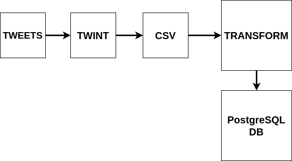

# Tweet-Scraping

Core idea: Build an ETL pipeline to scrape twitter for a given topic and feed it into a database

# 1) Extract

In order to scrape twitter I will use [twint](https://github.com/twintproject/twint) which makes it easier to scrape tweets without any authentication or API and can fetch all tweets. After scraping for the given topic I will store the raw data to a `csv` file.

# 2) Transform

After having a raw `csv` file, I will choose the desired columns to keep, for this project these are: tweets, time, timezone, language. After that I do some data cleaning by unifying the time to be all on the UTC reference.

# 3) Load

As a final step, I will store the data to be available for analysis. For this I will use [PostgreSQL](https://www.postgresql.org/), since I'm using a SQL database I need to define a primary key, which is a constraint that uniquely identifies each record on the table. For the primary key I will choose the tweet `id` given by twint.

# 4) Automation

A good way to keep the data flowing to the database is good to have a tool that can automate this procedure. The tool that I will use is [Apache Airflow](https://airflow.apache.org/). The reason that I chose Airflow is because it is an open-source project and is used by many data companies.

